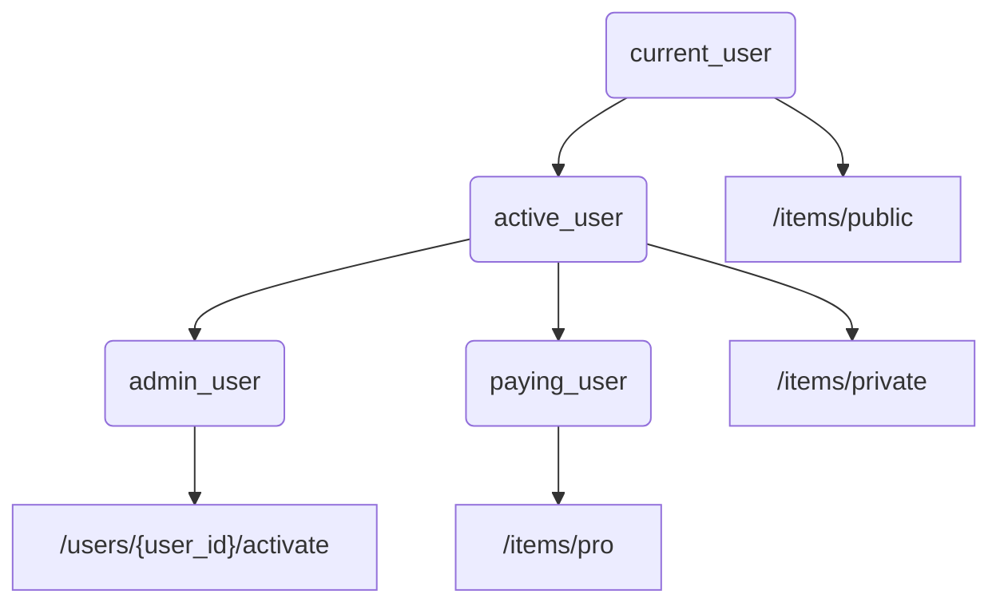

### FastAPI iteration

#### request body parsing

```python
from fastapi import FastAPI
from pydantic import BaseModel


class Item(BaseModel):
    name: str
    description: str | None = None
    price: float
    tax: float | None = None


app = FastAPI()


@app.post("/items/")
async def create_item(item: Item):
    return item
```

This code defines a FastAPI application with a single endpoint that accepts a POST request with a JSON body. The body is parsed into an `Item` model defined using Pydantic, which provides data validation and serialization.
Just declaring a type let's see what fastapi does with it:

1. Read the body of the request as JSON.
2. Convert the corresponding types (if needed).
3. Validate the data.
   - If the data is invalid, it will return a nice and clear error, indicating exactly where and what was the incorrect data.
4. Give you the received data in the parameter `item`
   - As you declared it in the function to be of type Item, you will also have all the editor support (completion, etc) for all of the attributes and their types.
5. Generate JSON Schema definitions for your model, you can also use them anywhere else you like if it makes sense for your project.
6. Those schemas will be part of the generated OpenAPI schema, and used by the automatic documentation UIs.

#### path parameters + query parameters + request body

The function parameters will be recognized as below:

- If the parameter is also declared in the path, it will be used as a path parameter.
- If the parameter is of a singular type (like int, float, str, bool, etc) it will be interpreted as a query parameter.
- If the parameter is declared to be of the type of a Pydantic model, it will be interpreted as a request body.

#### Response Model

```python
@app.post("/items/")
async def create_item(item: Item) -> Item:
    return item
```

FastAPI will use this retrun type to:

- Validate the returned data.
  - If the data is invalid, it means that your app code is broken, not returning what it should, and it will return a server error instead of returning incorrect data. This way you and your clients can be certain that they will receive the data and the data shape expected.
- Add a `JSON Schema` for the response, in the OpenAPI path operation,
  - This will be used by the `automatic docs`.
  - It will also be used by automatic client code generation tools.

**But most importantly**

- It will `limit and filter` the output data to what is defined in the return type.
  - This is particularly important for `security`

##### model_exclude and model_include

```python
@app.get(
    "/items/{item_id}/name",
    response_model=Item,
    response_model_include={"name", "description"},
)
def ......
```

or

```python
@app.get("/items/{item_id}/public",
        response_model=Item,
        response_model_exclude={"tax"})
def ......
```

This allows you to control which fields are only included or particularly excluded in the response model. Thus we can reuse the same model for different endpoints, but only expose the fields that are relevant to that endpoint.

#### Dependency Injection

```python

async def common_parameters(q: str | None = None, skip: int = 0, limit: int = 100):
    return {"q": q, "skip": skip, "limit": limit}


CommonsDep = Annotated[dict, Depends(common_parameters)]


@app.get("/items/")
async def read_items(commons: CommonsDep):
    return commons


@app.get("/users/")
async def read_users(commons: CommonsDep):
    return commons
```

Above code is a showcase of how to use dependency injection in FastAPI.
It's simple yet very powerful.
we can make a hierarchy of dependencies, where one dependency can depend on another.
Let we have 4 endpoints,

- `/items/public`
- `/items/private`
- `/users/{user_id}/activate`
- `/items/pro`

then we can add different permission requirements for each of them just with dependencies and sub-dependencies.



##### Three levels of dependencies

Dependencies in FastAPI can be applied at three levels:

1. **Parameter level**: Dependencies can be defined as function/class parameters they also return a value which is assigned to the parameter.
   - `async def read_items(commons: Annotated[dict, Depends(common_parameters)]):`
2. **Path operation level**: Dependencies can be defined at the path operation level, which need not to return a value
   - `@app.get("/items/", dependencies=[Depends(verify_token), Depends(verify_key)])`
3. **Global level**: Dependencies can be defined globally, which are applied to all path operations in the application.
   - `app = FastAPI(dependencies=[Depends(verify_token), Depends(verify_key)])`
